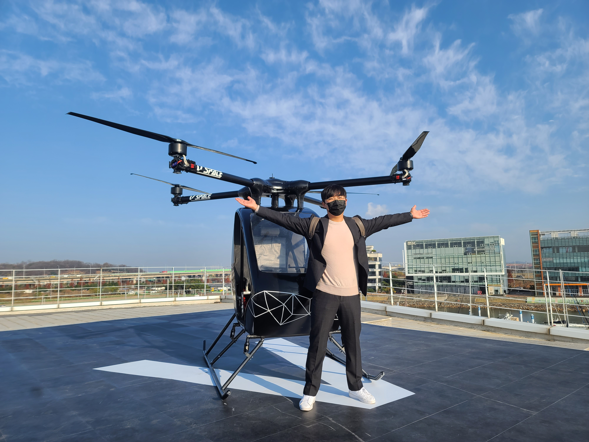
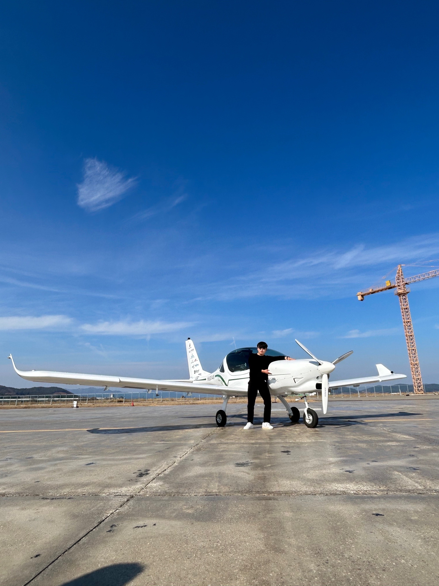

# 👋 Welcome to My Portfolio

I’m **SuHo Yu**, a systems engineer focused on electric aircraft, UAM, eVTOL, and battery systems.

## 🔗 Connect with Me

  
  

---

### ✈️ Recent Projects

- 🚁 Korea’s First Single-Seat UAM Demo Aircraft (TRL 5)
- 📦 100kg-class Heavy-Lift Drone with Redundant Propulsion
- 🔋 250Wh/kg Battery Pack for eVTOL Aircraft
- 🌐 International Flight Demonstrations: Abu Dhabi, UK, Kazakhstan
